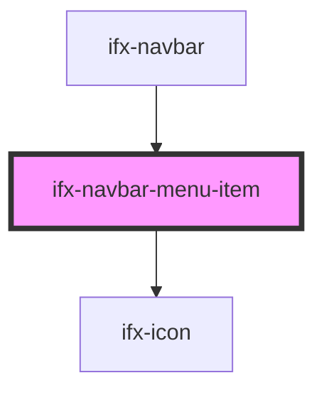

# ifx-navbar

<!-- Auto Generated Below -->

## Properties

| Property    | Attribute    | Description | Type      | Default |
| ----------- | ------------ | ----------- | --------- | ------- |
| `hideLabel` | `hide-label` |             | `boolean` | `false` |
| `isProfile` | `is-profile` |             | `boolean` | `false` |

## Dependencies

### Used by

 - [ifx-navbar](.)

### Depends on

- [ifx-icon](../icon)

### Graph

----------------------------------------------

*Built with [StencilJS](https://stenciljs.com/)*
