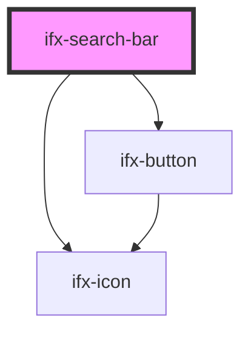

# ifx-search-bar

<!-- Auto Generated Below -->

## Properties

| Property | Attribute | Description | Type     | Default     |
| -------- | --------- | ----------- | -------- | ----------- |
| `icon`   | `icon`    |             | `string` | `undefined` |
| `width`  | `width`   |             | `string` | `'100%'`    |

## Events

| Event    | Description | Type                  |
| -------- | ----------- | --------------------- |
| `search` |             | `CustomEvent<string>` |

## Dependencies

### Depends on

- [ifx-icon](../icon)
- [ifx-button](../button)

### Graph

----------------------------------------------

*Built with [StencilJS](https://stenciljs.com/)*
