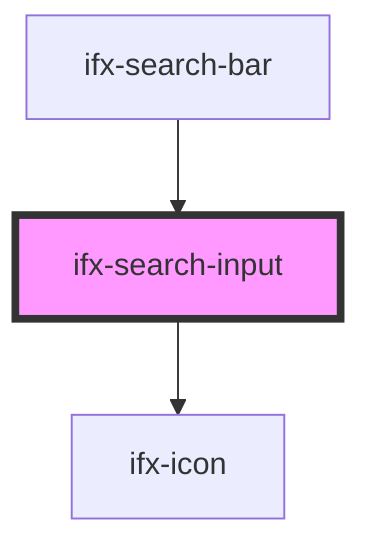

# ifx-search-input

<!-- Auto Generated Below -->

## Properties

| Property         | Attribute          | Description | Type                           | Default     |
| ---------------- | ------------------ | ----------- | ------------------------------ | ----------- |
| `borderColor`    | `border-color`     |             | `"dark" \| "green" \| "light"` | `undefined` |
| `disabled`       | `disabled`         |             | `boolean`                      | `false`     |
| `showDeleteIcon` | `show-delete-icon` |             | `boolean`                      | `false`     |
| `size`           | `size`             |             | `string`                       | `undefined` |
| `width`          | `width`            |             | `string`                       | `'100%'`    |

## Events

| Event    | Description | Type                  |
| -------- | ----------- | --------------------- |
| `search` |             | `CustomEvent<string>` |

## Dependencies

### Used by

 - [ifx-search-bar](../search-bar)

### Depends on

- [ifx-icon](../icon)

### Graph

----------------------------------------------

*Built with [StencilJS](https://stenciljs.com/)*
