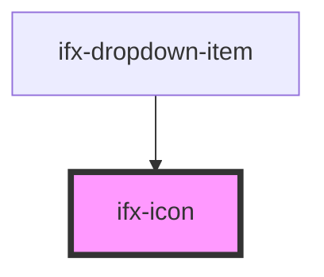

# ifx-icon

<!-- Auto Generated Below -->

## Properties

| Property      | Attribute       | Description | Type     | Default                                                                                                                                                                 |
| ------------- | --------------- | ----------- | -------- | ----------------------------------------------------------------------------------------------------------------------------------------------------------------------- |
| `icon`        | `icon`          |             | `any`    | `undefined`                                                                                                                                                             |
| `ifxIcon`     | `ifx-icon`      |             | `any`    | `undefined`                                                                                                                                                             |
| `path`        | `path`          |             | `string` | `'<path stroke="currentColor" stroke-linecap="round" stroke-linejoin="round" d="M19.5 13.5v-5a7 7 0 1 0-14 0v5c-.03 2.47-.72 4.887-2 7h18a13.833 13.833 0 0 1-2-7Z"/>'` |
| `svgIconTest` | `svg-icon-test` |             | `any`    | `undefined`                                                                                                                                                             |

## Dependencies

### Used by

 - [ifx-dropdown-item](./components/dropdown-item)

### Graph

----------------------------------------------

*Built with [StencilJS](https://stenciljs.com/)*
