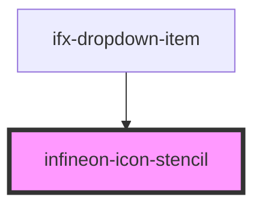

# infineon-icon-stencil

<!-- Auto Generated Below -->

## Properties

| Property           | Attribute            | Description | Type             | Default     |
| ------------------ | -------------------- | ----------- | ---------------- | ----------- |
| `icon`             | `icon`               |             | `any`            | `undefined` |
| `ifxIcon`          | `ifx-icon`           |             | `any`            | `undefined` |
| `path`             | --                   |             | `HTMLCollection` | `undefined` |
| `pathD`            | `path-d`             |             | `string`         | `undefined` |
| `svgHeight`        | `svg-height`         |             | `number`         | `undefined` |
| `svgLineJoin`      | `svg-line-join`      |             | `any`            | `undefined` |
| `svgStroke`        | `svg-stroke`         |             | `any`            | `undefined` |
| `svgStrokeLinecap` | `svg-stroke-linecap` |             | `any`            | `undefined` |
| `svgWidth`         | `svg-width`          |             | `number`         | `undefined` |

## Dependencies

### Used by

 - [ifx-dropdown-item](./components/dropdown-item)

### Graph

----------------------------------------------

*Built with [StencilJS](https://stenciljs.com/)*
